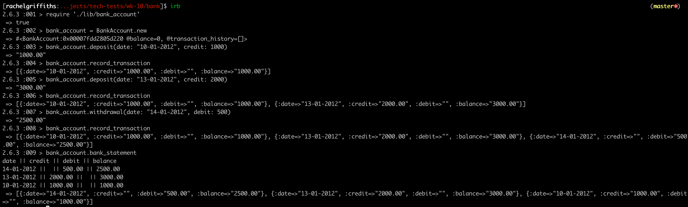

[](https://travis-ci.com/rachjgriff/bank)

# RACHEL GRIFFITHS: BANK CHALLENGE
----------
## PROJECT DESCRIPTION
----------
* Wk 10 Makers Tech Test Challenge
* Banking application to be accessed via a REPL (irb)
* User can make deposits and withdrawals, and print an up to date account statement.

## TECHNOLOGY
---------
* GitHub - Version Control
* Ruby 2.6.3 - Language
* RSpec - Testing Framework
* Rubocop - Linter
* SimpleCov - Test Coverage
* Travis - Continuous Integration

## INSTALLATION
---------
```
git clone git@github.com:rachjgriff/bank.git

bundle
```

## TESTING
---------
```
rspec

rubocop
```

## INSTRUCTIONS
---------
* To run in irb, follow the below instructions:



## REQUIREMENTS
---------
* Deposits, withdrawal.
* Account statement (date, amount, balance) printing.
* Data can be kept in memory (it doesn't need to be stored to a database or anything).

## ACCEPTANCE CRITERIA
---------
* **Given** a client makes a deposit of 1000 on 10-01-2012
* **And** a deposit of 2000 on 13-01-2012
* **And** a withdrawal of 500 on 14-01-2012
* **When** she prints her bank statement
* **Then** she would see

```
date || credit || debit || balance
14/01/2012 || || 500.00 || 2500.00
13/01/2012 || 2000.00 || || 3000.00
10/01/2012 || 1000.00 || || 1000.00
```

## APPROACH & STRATEGY
---------
* Class BankAccount
  * Initialize with:
    * @balance = 0
    * @transactions_history = []
* Methods:
  * deposit(date: , credit: )
  * withdrawal(date: , debit: )
  * record_transaction
  * bank_statement
* Actions:
  * Update balance
  * Store all transactions
  * Print transactions in above format and in reverse chronological order
* Assumptions:
  * Date, credit & debit are entered
  * Date is a string
  * Negative balance can be achieved (no )

##### QUESTIONS/THOUGHTS
* Need to ensure that **credit** is left blank if only a **withdrawal** is made
* Need to ensure that **debit** is left blank if only a **deposit** is made
* Is the client allowed to have a negative balance and continue to make withdrawals?
* Can the client make more than one deposit or withdrawal a day?
  * If so, should the credit and debit amounts sum these for that day?
  * Or can there be more than one entry for the same date?
* Should the date auto-generate rather than get added manually as a string?

## USER STORIES
---------

As a new bank account holder  
So that I can open a bank account  
I have a zero balance

As a new bank account holder  
So that I can open a bank account  
I have made no transaction history

As a bank account holder    
So that I can save for a holiday  
I can deposit money into my bank account

As a bank account holder  
So that I can buy lots of nice clothes for my holiday  
I can withdraw money from my bank account

As bank account holder  
So that I can ensure my bank account has been updated correctly  
I can store my transactions

As a bank account holder  
So that I can see how my balance is changing over time  
I can see my transaction history

As a bank account holder  
So that I can see how my current balance at the top of my bank statement  
I can see my most recent transaction first
